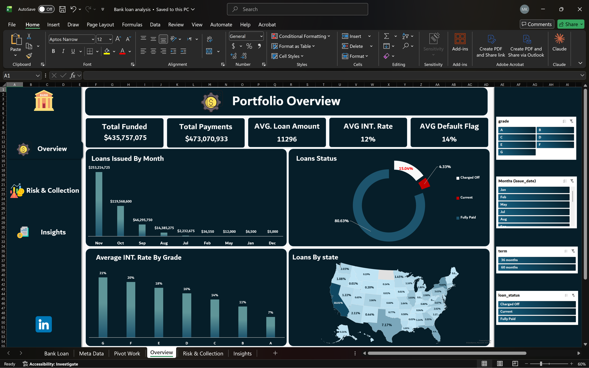
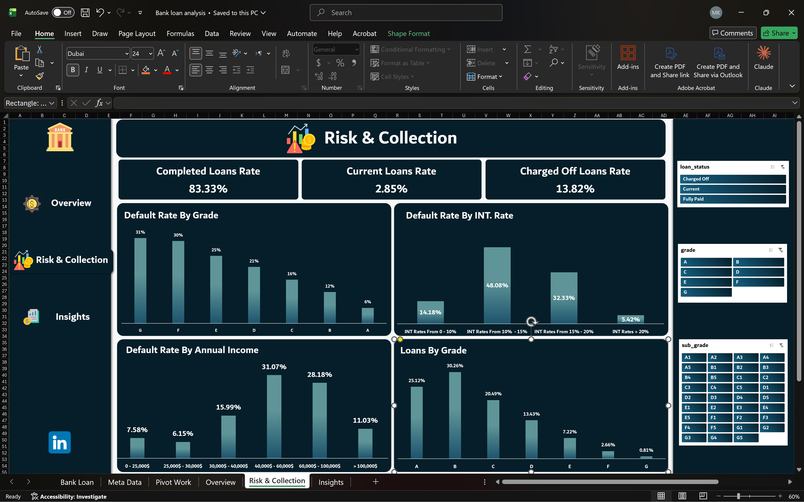
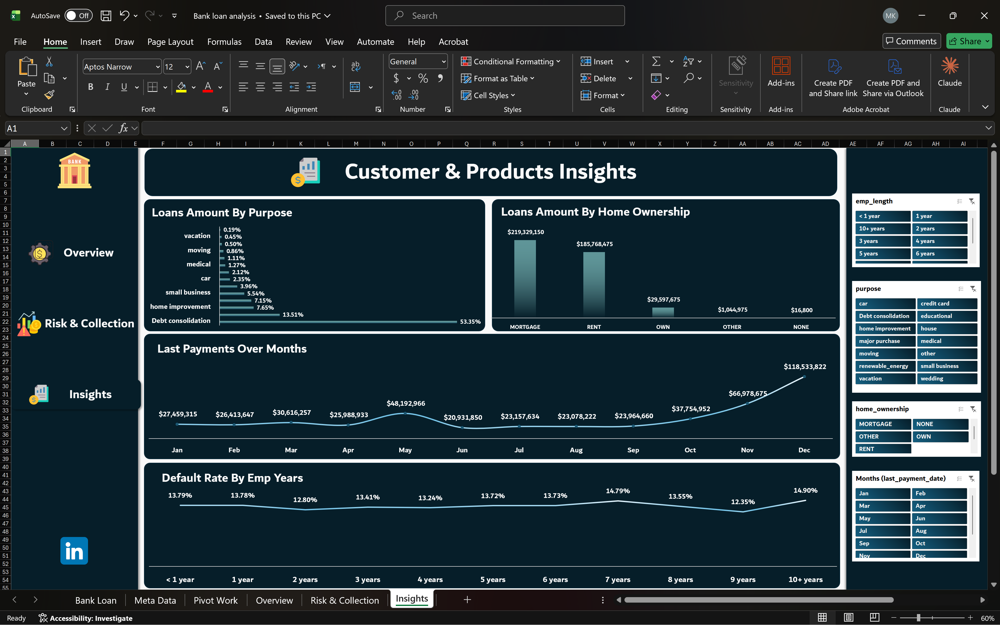

# Bank Loan Portfolio Analysis

An Excel dashboard analyzing 38,576 bank loans to answer one question: **which loans are most likely to default?**

## Dashboard

## Key numbers

| Metric | Value |
| --- | --- |
| Total funded amount | $435.8M |
| Total payments received | $473.1M |
| Average loan amount | $11,296 |
| Average interest rate | 12.05% |
| Default rate (charged-off loans) | 13.8% |

## Key insights

- **Grade is the strongest risk signal.** The default rate climbs from 5.7% for grade A to 31.3% for grade G.
- **Higher interest rates come with more defaults.** Loans priced under 10% default 6.4% of the time, compared with 33.7% for loans priced above 20%.
- **Income matters, but less.** Borrowers earning under $25K default at 17.8%, compared with 10.4% for those earning over $100K.
- **Employment length barely matters.** The default rate stays between 12.4% and 14.9% across all groups.
- **Lending grew every quarter.** Monthly funded amount rose from $25.0M in January to $54.0M in December.
- **Debt consolidation drives the portfolio.** It accounts for 53.4% of the funded amount, and California is the largest state at 18.0%.

## What I did

1. Added a `Default Flag` column (1 = Charged Off) to calculate default rates.
2. Fixed a data quality issue: day and month were swapped in `issue_date` and `last_payment_date`.
3. Built 14 pivot tables for KPIs, risk segments and customer segments.
4. Designed a three-page dashboard (Overview, Risk and Collection, Insights) with slicers and page navigation.

## Tools

Excel: Power query, Pivot Tables, Pivot Charts, slicers, map chart, structured table formulas.

## Data

[Route Academy Provides Data source from Real Bank]. 38,576 loans issued in 2021, 24 columns.

## Files

- `bank-loan-analysis.xlsx`: data, pivot tables and dashboard
- `Overview.png`, `Risk-collection.png`, `Insights.png`: dashboard screenshots
